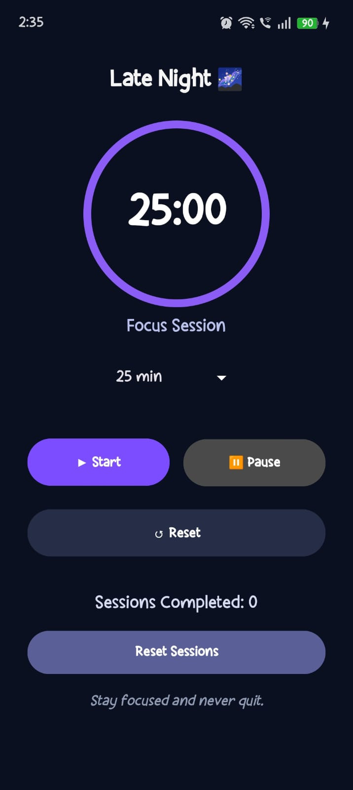
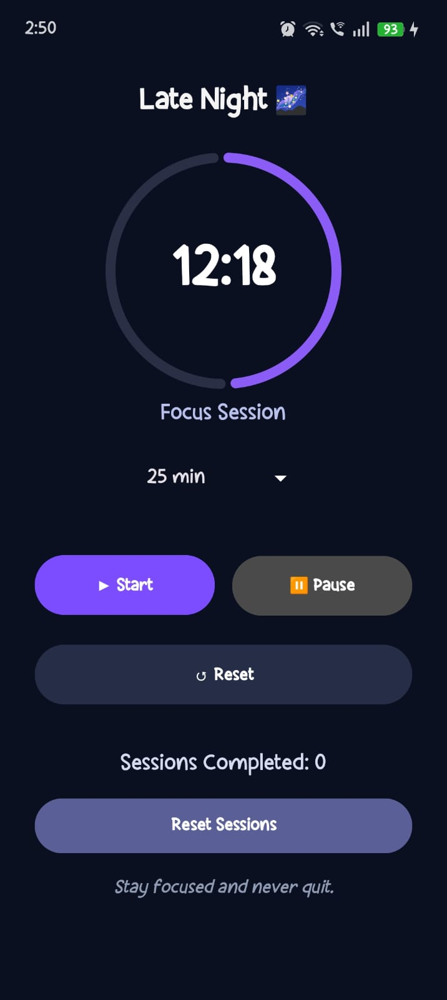
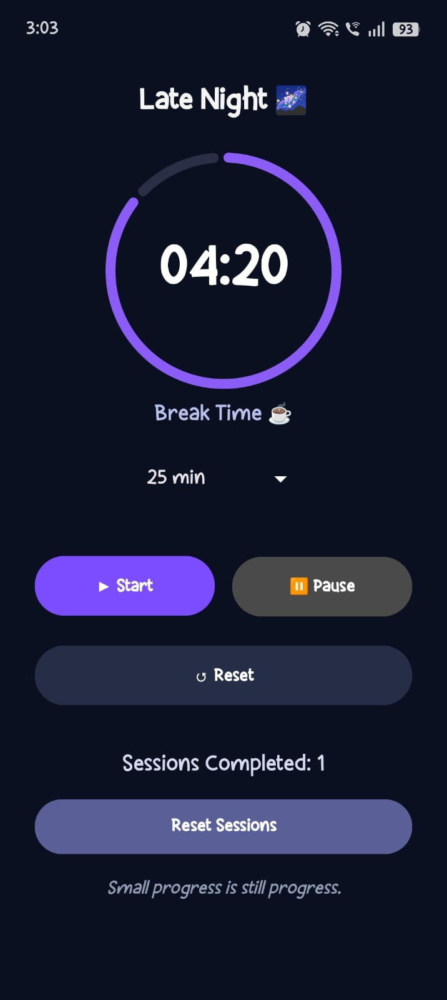

# 🌌 FocusFlow — Study Timer App

FocusFlow is a modern Android productivity app designed to help students stay focused using the Pomodoro technique.

Built with a dark aesthetic UI, animated circular progress timer, automatic break sessions, motivational quotes, and productivity-focused interactions.

---

# ✨ Features

- ⏳ Animated Circular Progress Timer
- ☕ Automatic Break Sessions
- 🎯 Custom Study Durations
  - 25 min
  - 45 min
  - 60 min
- 🌙 Modern Dark Theme UI
- 🔔 Completion Sound Notifications
- 💬 Motivational Quotes
- 📊 Session Tracking
- ♻️ Reset Session Counter
- 💾 Persistent Session Storage using SharedPreferences
- 🌅 Dynamic Greetings
- 🚀 Splash Screen
- 🎨 Custom App Branding & Icon

---

# 🛠️ Tech Stack

- Kotlin
- Android SDK
- XML Layouts
- Material Design Components
- SharedPreferences

---

# 📱 Screenshots

## Splash Screen


---

## Home Screen



---

## Timer Screen



---

## Break Screen



---

# 🚀 Setup Instrucctions

### 1. Clone the repository

```bash
git clone <your-repository-link>
```

### 2. Open project in Android Studio

### 3. Sync Gradle

### 4. Run the application on:
- Android Emulator
- Physical Android Device

---

# 📂 Project Structure

```bash
app/
 ├── java/com/meghana/focusflow/
 │    ├── MainActivity.kt
 │    └── SplashActivity.kt
 │
 ├── res/
 │    ├── layout/
 │    │    ├── activity_main.xml
 │    │    └── activity_splash.xml
 │    │
 │    ├── raw/
 │    ├── drawable/
 │    ├── mipmap/
 │    └── values/
```

---

# 🎯 Future Improvements

- Daily streak tracking
- Better animations
- Statistics dashboard
- Custom themes
- Focus music integration

---

# 📖 What I Learned

While building this project, I learned:

- Android Activity Lifecycle
- CountDownTimer usage
- UI design with XML
- Dark theme styling
- State management
- SharedPreferences
- Splash screens
- Material Design components
- Circular progress indicators
- Git & GitHub workflow

---

# 👨‍💻 Developed by

Meghana Merla
